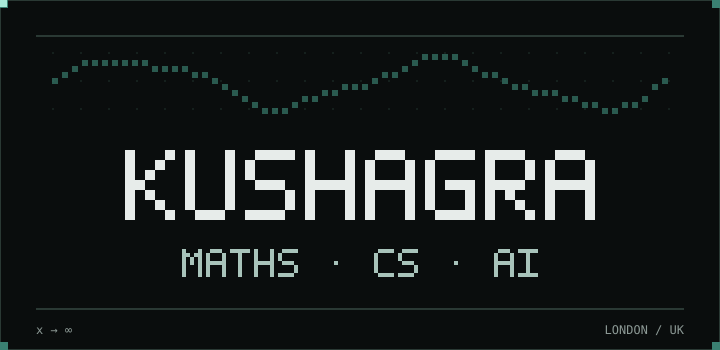
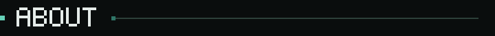
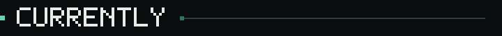
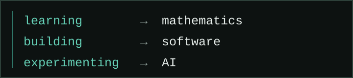
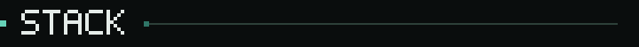
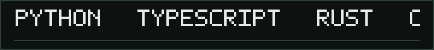
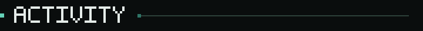
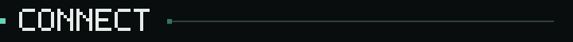
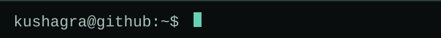

<picture>
  <source media="(prefers-reduced-motion: reduce)" srcset="assets/hero-still.svg">
  
</picture>

<picture>
  <source media="(max-width: 480px)" srcset="assets/heading-about-mobile.svg">
  
</picture>

Mathematics, computer science and AI. 
Usually building something that probably didn't need to be built.

<picture>
  <source media="(max-width: 480px)" srcset="assets/heading-currently-mobile.svg">
  
</picture>

<picture>
  <source media="(max-width: 480px)" srcset="assets/currently-mobile.svg">
  
</picture>

<picture>
  <source media="(max-width: 480px)" srcset="assets/heading-stack-mobile.svg">
  
</picture>

<picture>
  <source media="(prefers-reduced-motion: reduce)" srcset="assets/stack-still.svg">
  
</picture>

<picture>
  <source media="(max-width: 480px)" srcset="assets/heading-activity-mobile.svg">
  
</picture>

commits / experiments / questionable decisions

<picture>
  <source media="(max-width: 480px)" srcset="assets/heading-connect-mobile.svg">
  
</picture>

`github` [kushagr4](https://github.com/kushagr4) 
`linkedin` [kushagraratra](https://www.linkedin.com/in/kushagraratra/)

<picture>
  <source media="(prefers-reduced-motion: reduce)" srcset="assets/footer-still.svg">
  
</picture>
